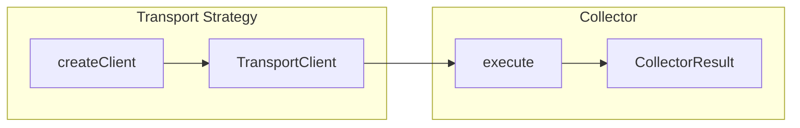

---
---
# Collector Plugin Development

## Overview

Collectors extend health check strategies by providing additional diagnostic metrics collection. While strategies handle **transport connectivity** (SSH, HTTP, SQL, etc.), collectors handle **domain-specific data extraction** through those transports.

**Key Separation:**
| Component | Responsibility | Example |
|-----------|----------------|---------|
| **Strategy** | Establish connection, provide transport client | SSH strategy connects to server |
| **Collector** | Use transport client to gather metrics | CPU collector runs commands via SSH |

This separation allows any collector to work with any compatible transport—CPU metrics can be collected over SSH, HTTP services can be checked via the HTTP transport, etc.

## Architecture



1. **Platform Executor** calls the strategy's `createClient()` to establish a connection
2. **Collectors** receive the connected `TransportClient` via their `execute()` method
3. **Results** are stored in `metadata.collectors.[instanceUUID]` with `_collectorId` metadata

### Collector Instance Identification

Each collector instance in a health check configuration has a unique UUID. When results are stored:

```typescript
// In metadata.collectors:
{
  "550e8400-e29b-41d4-a716-446655440000": {
    "_collectorId": "healthcheck-ssh.cpu",  // Type identifier for schema linking
    "usagePercent": 45.2,
    "loadAvg1m": 0.15
  },
  "6ba7b810-9dad-11d1-80b4-00c04fd430c8": {
    "_collectorId": "healthcheck-ssh.cpu",  // Same type, different instance
    "usagePercent": 32.8,
    "loadAvg1m": 0.08
  }
}
```

This allows multiple collectors of the same type to coexist without data collision.

## CollectorStrategy Interface

```typescript
import type { TransportClient } from "@checkstack/backend-api";

interface CollectorStrategy<
  TClient extends TransportClient<unknown, unknown>,
  TConfig = unknown,
  TResult = Record<string, unknown>,
  TAggregated = Record<string, unknown>
> {
  /** Unique identifier for this collector */
  id: string;

  /** Human-readable name */
  displayName: string;

  /** Optional description */
  description?: string;

  /** PluginMetadata of transport strategies this collector supports */
  supportedPlugins: PluginMetadata[];

  /** Allow multiple instances per health check config (default: false) */
  allowMultiple?: boolean;

  /** Collector configuration schema with versioning */
  config: Versioned<TConfig>;

  /** Per-execution result schema (with x-chart-* metadata) */
  result: Versioned<TResult>;

  /** Aggregated result schema for bucket storage */
  aggregatedResult: Versioned<TAggregated>;

  /** Execute the collector using the provided transport client */
  execute(params: {
    config: TConfig;
    client: TClient;
    pluginId: string;
  }): Promise<CollectorResult<TResult>>;

  /** Aggregate results from multiple runs into a summary */
  aggregateResult(runs: HealthCheckRunForAggregation<TResult>[]): TAggregated;
}
```

### Generic Parameters

| Parameter | Description |
|-----------|-------------|
| `TClient` | Transport client type (e.g., `SshTransportClient`, `HttpTransportClient`) |
| `TConfig` | Collector configuration schema type |
| `TResult` | Per-execution result type |
| `TAggregated` | Aggregated result type for bucket storage |

## Transport Clients

Each transport strategy provides a specific client interface:

| Protocol | Client Type | Command/Request | Result |
|----------|-------------|-----------------|--------|
| **SSH** | `SshTransportClient` | `string` (shell command) | `SshCommandResult` |
| **HTTP** | `HttpTransportClient` | `HttpRequest` | `HttpResponse` |
| **PostgreSQL** | `SqlTransportClient` | `SqlQueryRequest` | `SqlQueryResult` |
| **Redis** | `RedisTransportClient` | `RedisCommand` | `RedisCommandResult` |

Collectors declare compatibility via `supportedPlugins`:

```typescript
import { pluginMetadata as sshPluginMetadata } from "@checkstack/healthcheck-ssh-common";

export class CpuCollector implements CollectorStrategy<SshTransportClient, ...> {
  supportedPlugins = [sshPluginMetadata];
  // ...
}
```

## Schema Definitions

### Configuration Schema

Define what the collector needs to run:

```typescript
const cpuConfigSchema = z.object({
  includeLoadAverage: z
    .boolean()
    .default(true)
    .describe("Include 1m, 5m, 15m load averages"),
  includeCoreCount: z
    .boolean()
    .default(true)
    .describe("Include number of CPU cores"),
});
```

### Result Schema with Chart Metadata

Use `healthResultNumber`, `healthResultString`, etc. from `@checkstack/healthcheck-common` to annotate fields for auto-chart generation:

```typescript
import {
  healthResultNumber,
  healthResultString,
  healthResultBoolean,
} from "@checkstack/healthcheck-common";

const cpuResultSchema = z.object({
  usagePercent: healthResultNumber({
    "x-chart-type": "line",
    "x-chart-label": "CPU Usage",
    "x-chart-unit": "%",
  }),
  loadAvg1m: healthResultNumber({
    "x-chart-type": "line",
    "x-chart-label": "Load (1m)",
  }).optional(),
  coreCount: healthResultNumber({
    "x-chart-type": "counter",
    "x-chart-label": "CPU Cores",
  }).optional(),
});
```

### Chart Metadata Keys

| Key | Required | Description |
|-----|----------|-------------|
| `x-chart-type` | ✅ | Chart type: `line`, `bar`, `counter`, `gauge`, `boolean`, `text`, `status` |
| `x-chart-label` | Optional | Human-readable label (defaults to field name) |
| `x-chart-unit` | Optional | Unit suffix (e.g., `ms`, `%`, `bytes`) |

### Aggregated Result Schema

For bucket-level summaries:

```typescript
const cpuAggregatedSchema = z.object({
  avgUsagePercent: healthResultNumber({
    "x-chart-type": "line",
    "x-chart-label": "Avg CPU Usage",
    "x-chart-unit": "%",
  }),
  maxUsagePercent: healthResultNumber({
    "x-chart-type": "line",
    "x-chart-label": "Max CPU Usage",
    "x-chart-unit": "%",
  }),
});
```

## Complete Example

```typescript
import {
  Versioned,
  z,
  type HealthCheckRunForAggregation,
  type CollectorResult,
  type CollectorStrategy,
} from "@checkstack/backend-api";
import { healthResultNumber } from "@checkstack/healthcheck-common";
import {
  pluginMetadata as sshPluginMetadata,
  type SshTransportClient,
} from "@checkstack/healthcheck-ssh-common";

// Configuration
const cpuConfigSchema = z.object({
  includeLoadAverage: z.boolean().default(true),
});

type CpuConfig = z.infer<typeof cpuConfigSchema>;

// Result with chart annotations
const cpuResultSchema = z.object({
  usagePercent: healthResultNumber({
    "x-chart-type": "line",
    "x-chart-label": "CPU Usage",
    "x-chart-unit": "%",
  }),
  loadAvg1m: healthResultNumber({
    "x-chart-type": "line",
    "x-chart-label": "Load (1m)",
  }).optional(),
});

type CpuResult = z.infer<typeof cpuResultSchema>;

// Aggregated result
const cpuAggregatedSchema = z.object({
  avgUsagePercent: healthResultNumber({
    "x-chart-type": "line",
    "x-chart-label": "Avg CPU Usage",
    "x-chart-unit": "%",
  }),
});

type CpuAggregatedResult = z.infer<typeof cpuAggregatedSchema>;

// Collector implementation
export class CpuCollector
  implements CollectorStrategy<SshTransportClient, CpuConfig, CpuResult, CpuAggregatedResult>
{
  id = "cpu";
  displayName = "CPU Metrics";
  description = "Collects CPU usage via SSH";

  supportedPlugins = [sshPluginMetadata];

  config = new Versioned({ version: 1, schema: cpuConfigSchema });
  result = new Versioned({ version: 1, schema: cpuResultSchema });
  aggregatedResult = new Versioned({ version: 1, schema: cpuAggregatedSchema });

  async execute({
    config,
    client,
  }: {
    config: CpuConfig;
    client: SshTransportClient;
    pluginId: string;
  }): Promise<CollectorResult<CpuResult>> {
    // Get CPU stats via SSH
    const stat1 = await client.exec("cat /proc/stat | head -1");
    await new Promise((resolve) => setTimeout(resolve, 100));
    const stat2 = await client.exec("cat /proc/stat | head -1");

    const usagePercent = this.calculateCpuUsage(stat1.stdout, stat2.stdout);
    const result: CpuResult = { usagePercent };

    if (config.includeLoadAverage) {
      const uptime = await client.exec("cat /proc/loadavg");
      const parts = uptime.stdout.trim().split(/\s+/);
      result.loadAvg1m = parseFloat(parts[0]) || undefined;
    }

    return { result };
  }

  aggregateResult(runs: HealthCheckRunForAggregation<CpuResult>[]): CpuAggregatedResult {
    const usages = runs
      .map((r) => r.metadata?.usagePercent)
      .filter((v): v is number => typeof v === "number");

    return {
      avgUsagePercent:
        usages.length > 0
          ? Math.round((usages.reduce((a, b) => a + b, 0) / usages.length) * 10) / 10
          : 0,
    };
  }

  private calculateCpuUsage(stat1: string, stat2: string): number {
    // Parse /proc/stat and calculate usage delta
    const parse = (line: string) => {
      const parts = line.trim().split(/\s+/).slice(1).map(Number);
      const idle = parts[3] + parts[4];
      const total = parts.reduce((a, b) => a + b, 0);
      return { idle, total };
    };

    const s1 = parse(stat1);
    const s2 = parse(stat2);
    const idleDelta = s2.idle - s1.idle;
    const totalDelta = s2.total - s1.total;

    if (totalDelta === 0) return 0;
    return Math.round(((totalDelta - idleDelta) / totalDelta) * 100 * 10) / 10;
  }
}
```

## Plugin Registration

Register collectors in your plugin's `init` phase:

```typescript
import { createBackendPlugin, coreServices } from "@checkstack/backend-api";
import { CpuCollector, MemoryCollector } from "./collectors";
import { pluginMetadata } from "./plugin-metadata";

export default createBackendPlugin({
  metadata: pluginMetadata,
  register(env) {
    env.registerInit({
      deps: {
        collectorRegistry: coreServices.collectorRegistry,
        logger: coreServices.logger,
      },
      init: async ({ collectorRegistry, logger }) => {
        // Register collectors - owner plugin metadata is auto-injected
        collectorRegistry.register(new CpuCollector());
        collectorRegistry.register(new MemoryCollector());

        logger.info("✅ Hardware collectors registered");
      },
    });
  },
});
```

> [!IMPORTANT]
> The registry automatically qualifies collector IDs with the owning plugin ID.
> A collector with `id = "cpu"` registered by `collector-hardware-backend` becomes `collector-hardware-backend.cpu`.

## Testing

Use protocol-isolated unit tests that mock the transport client:

```typescript
import { describe, it, expect } from "bun:test";
import { CpuCollector } from "./cpu";
import type { SshTransportClient, SshCommandResult } from "@checkstack/healthcheck-ssh-common";

describe("CpuCollector", () => {
  const mockClient: SshTransportClient = {
    exec: async (command: string): Promise<SshCommandResult> => {
      if (command.includes("/proc/stat")) {
        return {
          exitCode: 0,
          stdout: "cpu  100 200 300 400 50 60 70 0 0 0",
          stderr: "",
        };
      }
      if (command.includes("/proc/loadavg")) {
        return {
          exitCode: 0,
          stdout: "0.15 0.10 0.05 1/234 5678",
          stderr: "",
        };
      }
      return { exitCode: 1, stdout: "", stderr: "Unknown command" };
    },
  };

  it("should collect CPU usage", async () => {
    const collector = new CpuCollector();
    const result = await collector.execute({
      config: { includeLoadAverage: true },
      client: mockClient,
      pluginId: "healthcheck-ssh",
    });

    expect(result.result.usagePercent).toBeGreaterThanOrEqual(0);
    expect(result.result.loadAvg1m).toBe(0.15);
  });
});
```

## Next Steps

- [Health Check Strategy Development](./healthcheck-strategies.md) - Transport strategy implementation
- [Auto-Generated Charts](./healthcheck-strategies.md#auto-generated-charts) - Chart metadata reference
- [Plugin Development Guide](./plugins.md) - General plugin patterns
