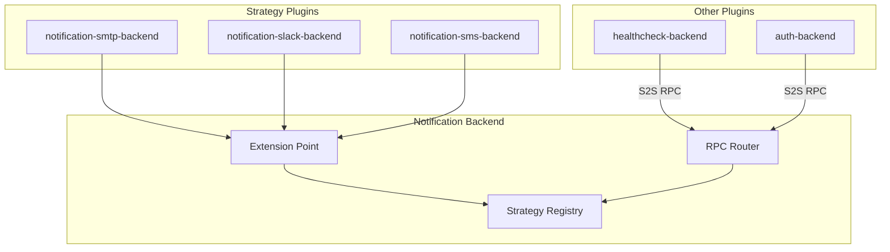

# Notification Strategies

The Notification Strategy system enables plugins to deliver notifications to users through external channels (email, Slack, Discord, SMS, etc.), extending beyond the platform's in-app notification system.

## Architecture Overview



## Core Concepts

### Namespaced Strategy IDs

Strategies are namespaced by their owning plugin's ID to prevent conflicts:

```typescript
// Plugin: notification-smtp-backend
// Strategy ID: smtp
// Qualified ID: notification-smtp.smtp
```

### Dynamic Permissions

Each registered strategy automatically generates a permission:

```
Format: {ownerPluginId}.strategy.{strategyId}.use
Example: notification-smtp.strategy.smtp.use
```

These permissions can be assigned to roles to control which users can receive notifications via specific channels.

### Contact Resolution

Strategies declare how they obtain user contact information:

| Type | Description | Example |
|------|-------------|---------|
| `auth-email` | Uses `user.email` from auth system | SMTP |
| `auth-provider` | Uses email from specific OAuth provider | Gmail-only notifications |
| `user-config` | User provides via settings form | SMS (phone number) |
| `oauth-link` | Requires OAuth flow | Slack, Discord |
| `custom` | Strategy handles resolution entirely | Custom integrations |

## Implementing a Strategy

### 1. Create Plugin Structure

```
plugins/notification-smtp-backend/
├── package.json
├── tsconfig.json
└── src/
    ├── plugin-metadata.ts
    └── index.ts
```

### 2. Define Configuration Schema

```typescript
import { z } from "zod";
import { secret, Versioned } from "@checkmate/backend-api";

const smtpConfigSchemaV1 = z.object({
  host: z.string().describe("SMTP server hostname"),
  port: z.number().default(587).describe("SMTP server port"),
  secure: z.boolean().default(false).describe("Use TLS/SSL"),
  username: secret().optional().describe("SMTP username"),
  password: secret().optional().describe("SMTP password"),
  fromAddress: z.string().email().describe("Sender email address"),
  fromName: z.string().optional().describe("Sender display name"),
});

type SmtpConfig = z.infer<typeof smtpConfigSchemaV1>;
```

### 3. Implement the Strategy Interface

```typescript
import { NotificationStrategy, Versioned } from "@checkmate/backend-api";

const smtpStrategy: NotificationStrategy<SmtpConfig> = {
  id: "smtp",
  displayName: "Email (SMTP)",
  description: "Send notifications via email using SMTP",
  icon: "mail",

  config: new Versioned({
    version: 1,
    schema: smtpConfigSchemaV1,
  }),

  contactResolution: { type: "auth-email" },

  async send({ contact, notification, strategyConfig }) {
    // contact = user's email address (resolved from auth)
    // notification = { title, description, importance, actionUrl, type }
    // strategyConfig = admin-configured SMTP settings

    await transporter.sendMail({
      from: strategyConfig.fromAddress,
      to: contact,
      subject: notification.title,
      text: notification.description,
    });

    return { success: true };
  },
};
```

### 4. Register via Extension Point

```typescript
import { createBackendPlugin } from "@checkmate/backend-api";
import { notificationStrategyExtensionPoint } from "@checkmate/notification-backend";
import { pluginMetadata } from "./plugin-metadata";

export default createBackendPlugin({
  metadata: pluginMetadata,

  register(env) {
    const extensionPoint = env.getExtensionPoint(
      notificationStrategyExtensionPoint
    );

    extensionPoint.addStrategy(smtpStrategy, pluginMetadata);
  },
});
```

## Strategy Interface

```typescript
interface NotificationStrategy<TConfig = unknown, TUserConfig = undefined> {
  /** Strategy ID (namespace-qualified at runtime) */
  id: string;

  /** Display name for UI */
  displayName: string;

  /** Description */
  description?: string;

  /** Lucide icon name */
  icon?: string;

  /** Admin configuration schema */
  config: Versioned<TConfig>;

  /** Per-user configuration schema (optional) */
  userConfig?: Versioned<TUserConfig>;

  /** How contact info is resolved */
  contactResolution: NotificationContactResolution;

  /** Send a notification */
  send(
    context: NotificationSendContext<TConfig, TUserConfig>
  ): Promise<NotificationDeliveryResult>;

  /** Optional: OAuth linking URL */
  getOAuthLinkUrl?(userId: string, returnUrl: string): Promise<string | undefined>;

  /** Optional: Handle OAuth callback */
  handleOAuthCallback?(
    userId: string,
    params: Record<string, string>
  ): Promise<{ success: boolean; error?: string }>;
}
```

## User Preferences

Users can configure their notification preferences per strategy:

### Database Schema

```sql
CREATE TABLE user_notification_preferences (
  user_id TEXT NOT NULL,
  strategy_id TEXT NOT NULL,       -- Qualified: {pluginId}.{strategyId}
  config JSONB,                     -- User-specific config (validated via userConfig)
  enabled BOOLEAN DEFAULT true,     -- User can disable channel
  external_id TEXT,                 -- OAuth-linked external ID
  linked_at TIMESTAMP,
  PRIMARY KEY (user_id, strategy_id)
);
```

### Contact Resolution Flow

1. Strategy declares `contactResolution` type
2. Platform resolves contact based on type:
   - `auth-email`: Query user's email from auth system
   - `user-config`: Query from `userNotificationPreferences.config`
   - `oauth-link`: Query from `userNotificationPreferences.external_id`
3. Skip user if contact cannot be resolved

## S2S RPC Endpoints

Plugins send external notifications via S2S RPC:

```typescript
// Send to specific users via specific strategy
await notificationApi.sendExternal({
  userIds: ["user-1", "user-2"],
  strategyId: "notification-smtp.smtp", // optional, defaults to all enabled
  notification: {
    title: "Health Check Failed",
    description: "System 'api-server' is degraded",
    importance: "critical",
    type: "healthcheck.alert",
  },
});

// Send transactional message (bypasses user preferences)
await notificationApi.sendTransactional({
  userId: "user-1",
  strategyId: "notification-smtp.smtp",
  message: {
    title: "Password Reset",
    description: "Click the link to reset your password",
    type: "password-reset",
  },
});
```

## Best Practices

### 1. Use Versioned Configurations

Always use `Versioned<T>` for config schemas to support future migrations:

```typescript
const configV1 = z.object({ host: z.string() });
const configV2 = z.object({ host: z.string(), timeout: z.number() });

const migration: Migration<typeof configV1, typeof configV2> = {
  fromVersion: 1,
  toVersion: 2,
  description: "Add timeout field",
  migrate: (data) => ({ ...data, timeout: 30000 }),
};
```

### 2. Handle Errors Gracefully

Return descriptive error messages for debugging:

```typescript
async send(context) {
  try {
    await sendEmail(context);
    return { success: true };
  } catch (error) {
    return {
      success: false,
      error: error instanceof Error ? error.message : "Unknown error",
    };
  }
}
```

### 3. Use Secrets for Sensitive Data

Use `secret()` for passwords and API keys:

```typescript
const config = z.object({
  apiKey: secret().describe("API key for service"),
});
```

### 4. Provide User-Friendly Icons

Use Lucide icon names for consistent UI:

```typescript
const strategy = {
  icon: "mail",        // SMTP
  icon: "slack",       // Slack
  icon: "phone",       // SMS
  icon: "message-circle", // Generic messaging
};
```

## See Also

- [Plugin Development](./plugins.md)
- [Configuration Service](./config-service.md)
- [Versioned Configs](./versioned-configs.md)
- [Signals](./signals.md)
